<div align="center">

<!-- ✨ ANIMATED 3D STAR BACKGROUND HEADER (Local SVG) -->


<!-- Typing Animation -->
<a href="https://github.com/akashkus121">
  
</a>

<br/>

<!-- Profile Views & Followers Badges -->
<p>
  
  <a href="https://github.com/akashkus121?tab=followers">
    
  </a>
  
</p>

</div>

---

## 👨‍💻 Developer Terminal

<div align="center">
  
</div>

---

## 👋 About Me

> 💻 **Software Developer | Full-Stack Developer**  
> I’m a Software Developer with **1.5+ years of experience** building robust, scalable web applications using **ASP.NET Core**, **Web API**, **React**, **Node.js**, and **SQL Server**.  
>  
> 🚀 I enjoy architecting **scalable APIs**, **real-time applications**, **database-driven systems**, and **clean, intuitive user interfaces**.

```typescript
const akash = {
  name:         "Akash Kushwaha",
  role:         "Software Developer | Full-Stack Developer",
  experience:   "1.5+ Years",
  backend:      ["C#", "ASP.NET Core", "Web API", "MVC", "Node.js", "Express.js"],
  frontend:     ["React.js", "Angular", "JavaScript", "TypeScript"],
  databases:    ["SQL Server", "MongoDB", "Redis"],
  tools:        ["Docker", "Git", "GitHub", "Azure", "IIS"],
  motto:        "Build → Learn → Improve → Repeat 🚀",
};
```

---

## ⚡ Core Engineering Capabilities

<table align="center" width="100%">
  <tr>
    <td width="33%" align="center" valign="top">
      <h3>🚀 Scalable Backends</h3>
      <p align="left">
        • High-throughput ASP.NET Core &amp; Web APIs<br/>
        • Clean Architecture &amp; MVC patterns<br/>
        • Microservices &amp; RESTful contracts<br/>
        • Entity Framework Core &amp; Dapper ORMs
      </p>
    </td>
    <td width="33%" align="center" valign="top">
      <h3>🎨 Modern Frontends</h3>
      <p align="left">
        • High-performance SPAs with React.js &amp; Angular<br/>
        • Strict type-safe TypeScript interfaces<br/>
        • State management &amp; seamless API integration<br/>
        • Responsive, modern UI/UX design
      </p>
    </td>
    <td width="33%" align="center" valign="top">
      <h3>🛡️ Data &amp; DevOps</h3>
      <p align="left">
        • SQL Server optimization &amp; schema design<br/>
        • High-speed caching (MongoDB, Redis)<br/>
        • Secure JWT Authentication &amp; RBAC<br/>
        • Containerization via Docker &amp; Azure Cloud
      </p>
    </td>
  </tr>
</table>

---

## 🛠️ Tech Stack

<div align="center">

### 🔧 Backend
<a href="https://skillicons.dev">
  
</a>

<br/><br/>

### ⚙️ Frontend
<a href="https://skillicons.dev">
  
</a>

<br/><br/>

### 🗄️ Databases & Cloud
<a href="https://skillicons.dev">
  
</a>

<br/><br/>

### 🚀 Tools & DevOps
<a href="https://skillicons.dev">
  
</a>

<br/><br/>

### 🧠 Core Concepts & Architecture
<p align="center">
  
  
  
  
  
  
</p>

</div>

---

## 📌 Currently Leveling Up

| Track | Focus | Status |
|:---|:---|:---:|
| 🏗️ **System Design** | High-concurrency architecture, caching strategies & load balancing | `⚡ Active` |
| ⚡ **Microservices** | Event-driven microservices with asynchronous messaging | `🔄 In Progress` |
| ☁️ **Cloud Computing** | Azure cloud deployment, serverless & container workflows | `🚀 Leveling Up` |
| 🤖 **AI & GenAI** | LLM API integrations, vector embeddings & intelligent agents | `🔍 Exploring` |

---

## 📊 GitHub Stats & Activity

<div align="center">
  
</div>

---

## 🤝 Let's Connect

<table align="center">
  <tr>
    <td align="center" width="110">
      <a href="https://github.com/akashkus121" target="_blank">
        
        <br /><sub><b>GitHub</b></sub>
      </a>
    </td>
    <td align="center" width="110">
      <a href="https://linkedin.com/in/akash-kushwaha-35b812227" target="_blank">
        
        <br /><sub><b>LinkedIn</b></sub>
      </a>
    </td>
    <td align="center" width="110">
      <a href="https://akashkusresume.netlify.app/" target="_blank">
        
        <br /><sub><b>Portfolio</b></sub>
      </a>
    </td>
    <td align="center" width="110">
      <a href="mailto:908akashkushwaha@gmail.com" target="_blank">
        
        <br /><sub><b>Email</b></sub>
      </a>
    </td>
  </tr>
</table>

<br/>

<div align="center">
  
</div>

---

<div align="center">
  <h3>✨ <i>Build → Learn → Improve → Repeat 🚀</i> ✨</h3>

  

  **⭐ If you like my work, consider giving my repos a star! ⭐**
</div>
