<div align="center">

<!-- ✨ ANIMATED 3D STAR BACKGROUND HEADER (Local SVG) -->


<!-- Typing Animation -->
<a href="https://github.com/akashkus121">
  
</a>

<br/>

<!-- Profile Views & Followers -->
<p>
  
  <a href="https://github.com/akashkus121?tab=followers">
    
  </a>
</p>

</div>

---

## 👋 About Me

> 💻 **Software Developer | Full-Stack Developer**  
> I’m a Software Developer with **1.5+ years of experience** building robust web applications using **ASP.NET Core**, **Web API**, **React**, **Node.js**, and **SQL Server**.  
>  
> 🚀 I enjoy building **scalable APIs**, **real-time applications**, **database-driven systems**, and **clean user interfaces**.

```typescript
const akash = {
  name:         "Akash Kushwaha",
  role:         "Software Developer | Full-Stack Developer",
  experience:   "1.5+ Years",
  backend:      ["C#", "ASP.NET Core", "Web API", "MVC", "Node.js", "Express.js"],
  frontend:     ["React.js", "Angular", "JavaScript", "TypeScript"],
  databases:    ["SQL Server", "MongoDB", "Redis"],
  tools:        ["Docker", "Git", "GitHub", "Azure", "IIS"],
  motto:        "Build → Learn → Improve → Repeat 🚀",
};
```

---

## 🛠️ Tech Stack

<div align="center">

### 🔧 Backend
<p align="center">
  
  
  
  
  
</p>

### ⚙️ Frontend
<p align="center">
  
  
  
  
  
  
</p>

### 🗄️ Databases
<p align="center">
  
  
  
</p>

### 🚀 Tools & DevOps
<p align="center">
  
  
  
  
  
  
  
</p>

### 🧠 Concepts & Architecture
<p align="center">
  
  
  
  
  
  
</p>

</div>

---

## 📌 Currently Learning

- 🏗️ **System Design & Scalable Architectures**
- ⚡ **Microservices & Event-Driven Systems**
- ☁️ **Cloud & Automated Deployment**
- 🤖 **AI & GenAI Fundamentals**

---

## 📊 GitHub Stats

<div align="center">
  
  
</div>

<div align="center">
  
</div>

---

## 🏆 GitHub Trophies

<div align="center">
  
</div>

---

## 📈 Contribution Graph

<div align="center">
  
</div>

---

## 🤝 Let's Connect

<table align="center">
  <tr>
    <td align="center" width="110">
      <a href="https://github.com/akashkus121" target="_blank">
        
        <br /><sub><b>GitHub</b></sub>
      </a>
    </td>
    <td align="center" width="110">
      <a href="https://linkedin.com/in/akash-kushwaha-35b812227" target="_blank">
        
        <br /><sub><b>LinkedIn</b></sub>
      </a>
    </td>
    <td align="center" width="110">
      <a href="https://akashkusresume.netlify.app/" target="_blank">
        
        <br /><sub><b>Portfolio</b></sub>
      </a>
    </td>
    <td align="center" width="110">
      <a href="mailto:908akashkushwaha@gmail.com" target="_blank">
        
        <br /><sub><b>Email</b></sub>
      </a>
    </td>
  </tr>
</table>

<br/>

<div align="center">
  
</div>

---

<div align="center">
  <h3>✨ <i>Build → Learn → Improve → Repeat 🚀</i> ✨</h3>

  

  **⭐ If you like my work, consider giving my repos a star! ⭐**
</div>
